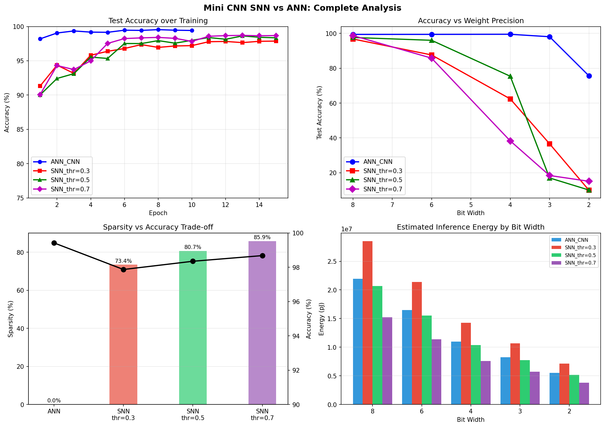

# Temporal SNN vs ANN: Energy-Efficient Classification

A comparative study of **Spiking Neural Networks (SNNs)** with true latency-based temporal coding against conventional ANNs on MNIST, investigating accuracy, spike sparsity, weight quantization robustness, and energy efficiency.

---

## Results



### Summary Table

| Model | Accuracy | Sparsity | Energy vs ANN |
|-------|----------|----------|---------------|
| ANN (Mini CNN) | 99.42% | 0% | baseline |
| SNN thr=0.3 | 97.87% | 73.4% | ❌ +30% |
| SNN thr=0.5 | 98.35% | 80.7% | ✅ −6% |
| **SNN thr=0.7** | **98.68%** | **85.9%** | ✅ **−30.8%** |

---

## Key Findings

### 1. Accuracy
- SNN with thr=0.7 achieves **98.68%** — only **0.74% below ANN**
- CNN architecture is critical: FC-only SNN gets 68%, CNN-SNN gets 98.68%
- Higher threshold → more selective firing → cleaner signal → better accuracy

### 2. Spike Sparsity
- True latency encoding: each pixel fires **exactly once** → 96%+ input sparsity
- SNN thr=0.7 achieves **85.9% hidden layer sparsity**
- Higher threshold → harder to fire → sparser activations

### 3. Energy Efficiency
- SNN thr=0.7 uses **30.8% less energy** than ANN
- SNNs use AC operations (0.9 pJ) vs ANN MAC operations (4.6 pJ) — 5x cheaper per operation
- Energy saving requires spike density < 20.4% → achieved by thr=0.7 (14.1% density)

### 4. Quantization Sensitivity
- ANN remains robust down to 2-bit (75.67%)
- SNNs collapse below 4-bit — open research challenge
- SNN thr=0.5 most robust — holds **75.43% at 4-bit**
- Root cause: temporal coding encodes information in spike timing — weight quantization shifts firing times → wrong classification

---

## Architecture

### ANN (Baseline)
```
Input (1×28×28)
→ Conv(32) → BN → ReLU → Conv(32) → BN → ReLU → MaxPool
→ Conv(64) → BN → ReLU → Conv(64) → BN → ReLU → MaxPool
→ FC(256) → Dropout → FC(10)
Parameters: 871,018
```

### SNN (Temporal Coding)
```
Input (1×28×28)
→ Latency Encode (each pixel fires once based on intensity)
→ [25 time steps]:
   Conv(32) → LIF → Conv(32) → LIF → MaxPool
   Conv(64) → LIF → Conv(64) → LIF → MaxPool
   FC(256)  → LIF → FC(10)   → LIF
→ Sum membrane potentials → classification
Parameters: 871,024
```

---

## How Temporal Coding Works

**Latency Encoding:**
```
Bright pixel (0.9) → fires at step 2  (early)
Medium pixel (0.5) → fires at step 12 (middle)
Dark pixel   (0.1) → fires at step 22 (late)
Zero pixel   (0.0) → never fires
```

**Leaky Integrate-and-Fire (LIF) Neuron:**
```
mem = beta × mem_prev + weight × spike_input
if mem ≥ threshold → fire spike, reset mem
if mem < threshold → silent (no computation!)
```

**Learned Delays via beta:**
Each neuron learns its own decay constant (beta), controlling its temporal sensitivity — neurons with high beta respond to late spikes, low beta to early spikes.

---

## Why This Matters for Hardware

| Operation | Energy | When |
|-----------|--------|------|
| ANN MAC | 4.6 pJ | Every neuron, every inference |
| SNN AC  | 0.9 pJ | Only when spike arrives |
| SNN silent | 0 pJ | 85.9% of the time |

Event-driven computation means power is only consumed when information is present — directly applicable to edge AI and ultra-low-power inference hardware.

---

## Setup & Installation

```bash
# Clone repository
git clone https://github.com/AmitDragon-India/temporal-snn-energy-analysis.git
cd temporal-snn-energy-analysis

# Create virtual environment
python -m venv venv
source venv/bin/activate  # Linux/Mac
venv\Scripts\activate     # Windows

# Install dependencies
pip install torch torchvision snntorch jupyter matplotlib numpy pandas seaborn
```

### Run
```bash
jupyter notebook snn_cnn_mnist.ipynb
```

MNIST dataset downloads automatically on first run.

---

## Tech Stack

| Tool | Purpose |
|------|---------|
| PyTorch | Neural network training |
| snnTorch | SNN simulation & surrogate gradients |
| CUDA (GTX 1650) | GPU acceleration |
| MNIST | Benchmark dataset |

---

## Author

**Amit Chaudhari**
M.Tech, Electrical Engineering — IIT Bombay
[LinkedIn](https://www.linkedin.com/in/amit-chaudhari-21b6ab157/) | [GitHub](https://github.com/AmitDragon-India)
